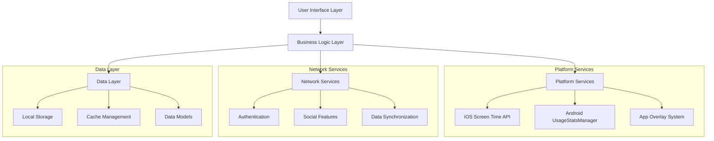

# Design Document: Social Time Tracker

## Overview

The Social Time Tracker is a cross-platform mobile application that combines personal digital wellness monitoring with social gamification. The app leverages platform-specific APIs (iOS Screen Time API and Android UsageStatsManager) to track app usage while providing social features through friend networks, leaderboards, and challenge systems.

The architecture follows a modular design with clear separation between data collection, social features, and user interface components. The app emphasizes smooth user experience through rich animations, haptic feedback, and responsive design patterns.

## Architecture

### High-Level Architecture



### Component Architecture

The application is structured into six main components:

1. **Usage Tracking Engine**: Interfaces with platform-specific APIs to collect app usage data
2. **Social Network Manager**: Handles friend relationships, user discovery, and privacy controls
3. **Challenge System**: Manages challenge creation, enforcement, and completion tracking
4. **Gamification Engine**: Handles coins, badges, leaderboards, and global rankings
5. **UI/UX Controller**: Manages themes, animations, haptic feedback, and navigation
6. **Data Synchronization Service**: Handles local storage and cloud synchronization

## Components and Interfaces

### Usage Tracking Engine

**Purpose**: Collect and process app usage data from platform-specific APIs

**Key Interfaces**:
```typescript
interface UsageTracker {
  startMonitoring(): Promise<void>
  getUsageStats(timeRange: TimeRange, apps?: string[]): Promise<UsageStats[]>
  getCurrentActiveApp(): Promise<string | null>
  requestPermissions(): Promise<boolean>
}

interface UsageStats {
  appId: string
  appName: string
  totalTime: number
  sessions: Session[]
  lastUsed: Date
}

interface Session {
  startTime: Date
  endTime: Date
  duration: number
}
```

**Platform Implementations**:
- **iOS**: Uses DeviceActivity framework and FamilyControls for monitoring
- **Android**: Uses UsageStatsManager with background service for real-time tracking

### Social Network Manager

**Purpose**: Handle user relationships and privacy controls

**Key Interfaces**:
```typescript
interface SocialManager {
  searchUsers(query: string): Promise<User[]>
  sendFriendRequest(username: string): Promise<void>
  acceptFriendRequest(requestId: string): Promise<void>
  getFriends(): Promise<User[]>
  updatePrivacySettings(hiddenApps: string[]): Promise<void>
  getVisibleUsageForFriend(friendId: string): Promise<UsageStats[]>
}

interface User {
  id: string
  username: string
  profileImage?: string
  totalCoins: number
  isOnline: boolean
  hiddenApps: string[]
}
```

### Challenge System

**Purpose**: Create, enforce, and track challenges with strict app blocking

**Key Interfaces**:
```typescript
interface ChallengeManager {
  createChallenge(challenge: ChallengeConfig): Promise<Challenge>
  joinChallenge(challengeId: string): Promise<void>
  startChallenge(challengeId: string): Promise<void>
  forfeitChallenge(challengeId: string): Promise<void>
  getActiveChallenges(): Promise<Challenge[]>
  checkChallengeViolation(appId: string): Promise<boolean>
}

interface Challenge {
  id: string
  name: string
  targetApp: string
  timeLimit: number
  duration: number
  startTime?: Date
  endTime?: Date
  status: ChallengeStatus
  participants: string[]
  coinReward: number
  coinPenalty: number
}

interface ChallengeOverlay {
  show(challenge: Challenge): void
  hide(): void
  onForfeit: () => void
  onReturn: () => void
}
```

**Challenge Enforcement**:
- **iOS**: Uses ManagedSettings framework to shield apps during active challenges
- **Android**: Implements system overlay with SYSTEM_ALERT_WINDOW permission to block app access

### Gamification Engine

**Purpose**: Manage coins, badges, and ranking systems

**Key Interfaces**:
```typescript
interface GamificationManager {
  awardCoins(userId: string, amount: number, reason: string): Promise<void>
  deductCoins(userId: string, amount: number, reason: string): Promise<void>
  awardBadge(userId: string, badgeType: BadgeType): Promise<void>
  getLeaderboard(type: LeaderboardType, timeRange: TimeRange): Promise<LeaderboardEntry[]>
  getGlobalRanking(userId: string): Promise<GlobalRank>
}

interface LeaderboardEntry {
  user: User
  value: number
  rank: number
  change: number
}

interface GlobalRank {
  position: number
  totalUsers: number
  coins: number
  percentile: number
}
```

### UI/UX Controller

**Purpose**: Manage themes, animations, and user feedback

**Key Interfaces**:
```typescript
interface UIController {
  setTheme(theme: Theme): void
  animatePageTransition(from: Page, to: Page): Promise<void>
  animateCoinReward(amount: number, fromElement: Element): Promise<void>
  playHapticFeedback(type: HapticType): void
  playAudioFeedback(type: AudioType): void
  showRingLight(element: Element, color: string): void
}

enum HapticType {
  SUBTLE = 'subtle',
  MODERATE = 'moderate',
  STRONG = 'strong'
}

enum Theme {
  LIGHT = 'light',
  DARK = 'dark'
}
```

## Data Models

### Core Data Models

```typescript
interface AppUsageData {
  userId: string
  appId: string
  appName: string
  date: Date
  totalTime: number
  sessionCount: number
  sessions: UsageSession[]
  isHidden: boolean
}

interface UsageSession {
  startTime: Date
  endTime: Date
  duration: number
  deviceId: string
}

interface UserProfile {
  id: string
  username: string
  email: string
  profileImage?: string
  createdAt: Date
  totalCoins: number
  badges: Badge[]
  friends: string[]
  hiddenApps: string[]
  preferences: UserPreferences
}

interface UserPreferences {
  theme: Theme
  notifications: NotificationSettings
  privacy: PrivacySettings
  hapticEnabled: boolean
  audioEnabled: boolean
}

interface ChallengeData {
  id: string
  creatorId: string
  name: string
  description: string
  targetApp: string
  timeLimit: number
  duration: number
  coinReward: number
  coinPenalty: number
  isPopular: boolean
  participants: ChallengeParticipant[]
  createdAt: Date
  startTime?: Date
  endTime?: Date
}

interface ChallengeParticipant {
  userId: string
  joinedAt: Date
  status: ChallengeStatus
  completedAt?: Date
  forfeitedAt?: Date
}

enum ChallengeStatus {
  PENDING = 'pending',
  ACTIVE = 'active',
  COMPLETED = 'completed',
  FAILED = 'failed',
  FORFEITED = 'forfeited'
}
```

### Database Schema

The app uses a hybrid storage approach with comprehensive offline functionality:
- **Local Storage**: SQLite for complete offline operation
- **Cloud Storage**: Firebase/Supabase for synchronization and backup

**Local Tables**:
- `usage_data`: App usage sessions and statistics
- `friends`: Complete friend data for offline access
- `user_profiles`: Cached user profiles and preferences
- `challenges_local`: Local challenge state and progress
- `badges`: User badges and achievements
- `coins_transactions`: Complete coin transaction history
- `leaderboards_cache`: Cached leaderboard data for offline viewing
- `app_metadata`: App information and icons for offline display
- `sync_queue`: Pending synchronization operations

**Cloud Collections**:
- `users`: User profiles and preferences (sync source)
- `friendships`: Bidirectional friend relationships (sync source)
- `challenges`: Challenge definitions and participation (sync source)
- `global_stats`: System-wide statistics and rankings (sync source)

**Offline-First Design**:
- All core functionality operates from local database
- Only leaderboards require network connectivity for real-time rankings
- Users can delete old usage data locally while preserving recent data
- Synchronization occurs in background when network is available

## Error Handling

### Platform-Specific Error Handling

**iOS Screen Time API Errors**:
- Permission denied: Redirect to settings with clear instructions
- API unavailable: Graceful degradation with manual tracking option
- Shield configuration errors: Fallback to notification-based reminders

**Android UsageStatsManager Errors**:
- Usage access permission denied: Show permission request flow
- Background service limitations: Implement foreground service for active challenges
- Overlay permission denied: Request SYSTEM_ALERT_WINDOW permission

### Network and Synchronization Errors

### Offline Handling and Data Management

**Complete Offline Functionality**:
- All features except real-time leaderboards work offline
- Local SQLite database stores complete user data
- Challenge enforcement works without network connectivity
- Friend data and profiles cached locally for offline access
- Badge and coin systems operate entirely offline

**Leaderboard Network Dependency**:
- Leaderboard page shows "reload" message when offline
- Cached leaderboard data displayed when available
- Real-time rankings require network connectivity
- All other pages function normally offline

**Data Retention and Cleanup**:
- Users can delete old usage data to free storage space
- Configurable data retention periods (30, 60, 90 days, or unlimited)
- Recent data (last 7 days) always preserved for core functionality
- Selective deletion by app or time period

**Data Conflicts**:
- Usage data: Use device-local timestamps as source of truth
- Social actions: Implement last-write-wins with user notification
- Challenge states: Server-side validation with rollback on conflicts

### User Experience Error Recovery

**Challenge Enforcement Failures**:
- iOS shield bypass: Log violation and notify user of challenge failure
- Android overlay bypass: Detect through usage monitoring and apply penalty
- System restart during challenge: Resume challenge state on app launch

## Testing Strategy

The testing strategy employs both unit testing and property-based testing to ensure comprehensive coverage of the complex social and gamification features.

### Unit Testing Focus Areas

**Platform Integration Tests**:
- iOS Screen Time API integration with mock DeviceActivity events
- Android UsageStatsManager integration with simulated usage data
- Challenge overlay display and interaction handling
- Haptic and audio feedback system responses

**Social Feature Tests**:
- Friend request workflows and state management
- Privacy setting enforcement for hidden apps
- Leaderboard calculation with various user configurations
- Challenge invitation and acceptance flows

**Edge Case Testing**:
- Network connectivity loss during critical operations
- App termination during active challenges
- Permission revocation scenarios
- Data corruption and recovery procedures

### Property-Based Testing Configuration

The app will use **fast-check** for JavaScript/TypeScript property-based testing, configured to run a minimum of 100 iterations per property test. Each property test will be tagged with a comment referencing its design document property.

**Tag Format**: `// Feature: social-time-tracker, Property {number}: {property_text}`

**Testing Libraries**:
- **Primary**: fast-check for comprehensive property testing
- **Platform**: Jest for unit testing framework
- **Mocking**: MSW for API mocking and network simulation
- **Integration**: Detox for end-to-end mobile testing

## Correctness Properties

*A property is a characteristic or behavior that should hold true across all valid executions of a system—essentially, a formal statement about what the system should do. Properties serve as the bridge between human-readable specifications and machine-verifiable correctness guarantees.*

### Property 1: Usage Data Collection Completeness
*For any* sequence of app usage events (open, close, switch), the Time_Tracker should capture all events with accurate timestamps and calculate correct session durations.
**Validates: Requirements 1.1, 1.2, 1.3**

### Property 2: Usage Data Aggregation Accuracy
*For any* collection of usage sessions, aggregating them by day, week, or month should produce totals that equal the sum of individual session durations.
**Validates: Requirements 1.4, 1.5**

### Property 3: Username System Integrity
*For any* username registration attempt, the system should enforce uniqueness, validate character restrictions (alphanumeric and underscores only), and maintain username uniqueness across all users.
**Validates: Requirements 2.1, 2.2, 2.4**

### Property 4: User Authentication Consistency
*For any* valid user account, authentication should succeed with correct credentials and fail with incorrect credentials.
**Validates: Requirements 2.3, 2.5**

### Property 5: User Search and Discovery
*For any* username search query, the system should return all matching users that exist and no users that don't match the query.
**Validates: Requirements 3.1**

### Property 6: Friendship Lifecycle Management
*For any* friend request between two users, the system should create a pending relationship, allow acceptance to create bidirectional friendship, and prevent duplicate requests.
**Validates: Requirements 3.2, 3.3, 3.5**

### Property 7: Friend List Consistency
*For any* user with confirmed friendships, their friends list should contain exactly the users with whom they have bidirectional friendship relationships.
**Validates: Requirements 3.4**

### Property 8: Privacy Control Enforcement
*For any* user with hidden apps configured, those apps should be excluded from friend leaderboards while still being included in total usage calculations.
**Validates: Requirements 3.6, 3.7**

### Property 9: Leaderboard Ranking Accuracy
*For any* group of friends and a specific app/time period, the leaderboard should rank users in descending order of usage time, excluding hidden apps from friend views.
**Validates: Requirements 4.1, 4.3**

### Property 10: Time Period Filtering Correctness
*For any* usage data spanning multiple time periods, filtering by "today", "this week", or "this month" should return only data within the specified time range.
**Validates: Requirements 4.2**

### Property 11: Challenge Creation and Configuration
*For any* challenge parameters (app, time limit, duration), the system should create a valid challenge that can be started, monitored, and completed.
**Validates: Requirements 5.1, 5.2**

### Property 12: Challenge Enforcement Blocking
*For any* active challenge with a restricted app, attempting to open that app should immediately display an unmovable overlay with only forfeit or return options.
**Validates: Requirements 5.3, 5.4, 9.1, 9.2, 9.3, 9.4**

### Property 13: Challenge Integrity Protection
*For any* active challenge, the system should prevent uninstallation of both the restricted app and the tracker app, and detect bypass attempts.
**Validates: Requirements 5.5, 9.5, 9.6**

### Property 14: Coin Transaction Management
*For any* challenge completion or forfeiture, the system should award or deduct the correct coin amount, ensure balances never go below zero, and provide appropriate feedback.
**Validates: Requirements 5.6, 5.7, 7.1, 7.2, 7.6**

### Property 15: Popular Challenge Distribution
*For any* admin-created popular challenge, it should be available to all users and enforce the same blocking mechanisms as personal challenges.
**Validates: Requirements 6.1, 6.2, 6.6**

### Property 16: Shared Challenge Leaderboards
*For any* popular challenge with multiple participants, the system should maintain a shared leaderboard that updates in real-time as users complete or fail.
**Validates: Requirements 6.4, 6.5**

### Property 17: Global Ranking Calculation
*For any* set of users with coin balances, the global ranking should order users by total coins in descending order and show correct positions.
**Validates: Requirements 7.3, 7.7**

### Property 18: Badge Management System
*For any* challenge completion, the system should award the appropriate badge, prevent duplicates, display badges in user profiles with timestamps, and notify users immediately.
**Validates: Requirements 8.1, 8.3, 8.4, 8.5**

### Property 19: Badge Variety and Categorization
*For any* set of challenges with different categories and difficulty levels, the system should award different badge types appropriately.
**Validates: Requirements 8.2**

### Property 20: Performance and Navigation Requirements
*For any* page navigation, the system should load within 2 seconds and maintain persistent navigation elements (coins, profile image, rankings).
**Validates: Requirements 10.7, 10.8, 10.9**

### Property 21: Audio Feedback System
*For any* challenge completion, the system should play celebratory audio effects without haptic feedback.
**Validates: Requirements 11.4**

### Property 22: Theme System Consistency
*For any* theme change between light and dark mode, the system should use the correct ring light colors (#E8DE2A for light, #D5B60A for dark) and maintain functionality.
**Validates: Requirements 11.6, 11.7, 11.8**

### Property 23: Data Encryption and Security
*For any* usage data stored locally, it should be encrypted using industry-standard methods and only shared with confirmed friends in aggregate form.
**Validates: Requirements 12.1, 12.3**

### Property 24: Data Access Permission Control
*For any* attempt to access device usage statistics, the system should require explicit user permission and only store duration metrics, not content.
**Validates: Requirements 12.4, 12.5**

### Property 25: Account Deletion and Data Removal
*For any* user account deletion, all associated usage data should be permanently removed within 30 days.
**Validates: Requirements 12.2**

### Property 26: Data Persistence and Synchronization
*For any* usage data collected, it should be immediately persisted locally and synchronized with remote servers when connectivity is available.
**Validates: Requirements 13.1, 13.2**

### Property 27: Conflict Resolution and Data Integrity
*For any* data synchronization conflicts, the system should resolve using the most recent timestamp and maintain data integrity during network interruptions.
**Validates: Requirements 13.3, 13.4**

### Property 28: Data Restoration Completeness
*For any* app reinstallation, the system should restore complete usage history and social connections from remote storage.
**Validates: Requirements 13.5**

### Property 29: Offline Functionality Completeness
*For any* core app feature except leaderboards, the system should operate fully offline using local database, with leaderboards showing appropriate offline messaging.
**Validates: Requirements 13.1, 13.2**

### Property 30: Data Retention and Cleanup
*For any* user-initiated data cleanup, the system should delete old data while preserving recent data (last 7 days) and maintaining app functionality.
**Validates: Requirements 13.1**

## Testing Strategy

### Dual Testing Approach

The Social Time Tracker employs both unit testing and property-based testing to ensure comprehensive coverage of its complex social and gamification features.

**Unit Testing Focus**:
- Specific examples of challenge scenarios (e.g., "YouTube 2 hour fast")
- Edge cases like users with no friends viewing leaderboards
- Integration points between platform APIs and app logic
- Error conditions and recovery scenarios
- UI page content verification (Home, Leaderboard, Challenges, Profile pages)

**Property-Based Testing Focus**:
- Universal properties that hold across all valid inputs
- Comprehensive input coverage through randomization
- Data integrity across different user configurations
- Challenge enforcement across various app combinations
- Social feature correctness with different friend network topologies

### Property-Based Testing Configuration

**Testing Library**: fast-check for JavaScript/TypeScript
**Minimum Iterations**: 100 per property test
**Tag Format**: `// Feature: social-time-tracker, Property {number}: {property_text}`

**Example Property Test Structure**:
```typescript
// Feature: social-time-tracker, Property 1: Usage Data Collection Completeness
test('usage data collection completeness', () => {
  fc.assert(fc.property(
    fc.array(appUsageEventArb),
    (events) => {
      const tracker = new UsageTracker();
      const sessions = tracker.processEvents(events);
      
      // Verify all events are captured
      expect(sessions.length).toBeGreaterThanOrEqual(0);
      
      // Verify session durations are calculated correctly
      sessions.forEach(session => {
        expect(session.duration).toBe(
          session.endTime.getTime() - session.startTime.getTime()
        );
      });
    }
  ), { numRuns: 100 });
});
```

### Integration Testing Strategy

**Platform-Specific Testing**:
- iOS: Mock DeviceActivity framework responses and FamilyControls shield configurations
- Android: Simulate UsageStatsManager data and overlay system interactions
- Cross-platform: Verify consistent behavior across both platforms

**Social Feature Testing**:
- Multi-user scenarios with various friend network configurations
- Challenge participation across different user groups
- Leaderboard accuracy with privacy settings enabled
- Real-time synchronization between multiple app instances

**Performance Testing**:
- Page load time verification (2-second requirement)
- Large dataset handling for users with extensive usage history
- Network resilience during synchronization operations
- Memory usage during long-running challenge enforcement