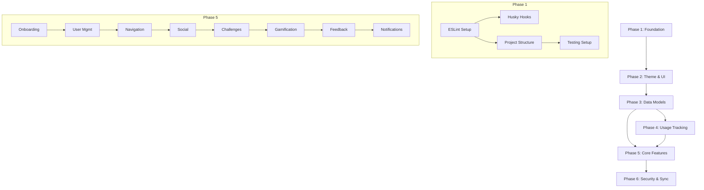

# Implementation Sequence: Social Time Tracker

This document provides a structured, sequenced implementation order for the Social Time Tracker app. Tasks are organized from foundational setup to advanced features, with dependencies clearly marked.

---

## Phase 1: Project Foundation & Linting Setup

> [!IMPORTANT]
> Complete this phase before any feature development. Establishes code quality standards and project structure.

### 1.1 ESLint & Prettier Configuration

- [x] **1.1.1** Install Prettier and ESLint plugins
  ```
  Dependencies: prettier, eslint-plugin-prettier, eslint-config-prettier
  ```
- [x] **1.1.2** Update [eslint.config.js](file:///c:/Users/patra/Desktop/CompleteProjects/TimerApp/eslint.config.js)
  - Add Prettier integration rules
  - Configure TypeScript-specific rules
  - Add React Native & Expo specific rules
- [x] **1.1.3** Create `.prettierrc` config file
  - Define formatting rules (semi, quotes, tabWidth, etc.)
- [x] **1.1.4** Add `lint:fix` script to fix auto-fixable errors

**Requirements:** 10.1, 10.2

---

### 1.2 Pre-commit Hook Setup (Husky + lint-staged)

- [x] **1.2.1** Install Husky and lint-staged
  ```
  Dependencies: husky, lint-staged
  ```
- [x] **1.2.2** Initialize Husky
  ```bash
  npx husky init
  ```
- [x] **1.2.3** Configure `.husky/pre-commit` hook
  - Run lint-staged on staged files
- [x] **1.2.4** Update [package.json](file:///c:/Users/patra/Desktop/CompleteProjects/TimerApp/package.json)
  - Add `prepare` script: `"prepare": "husky"`
  - Add `lint-staged` configuration block
  - Add pre-push hook to auto-lint and fix errors

**Final package.json scripts:**

```json
{
  "scripts": {
    "lint": "expo lint",
    "lint:fix": "eslint . --fix",
    "prepare": "husky"
  },
  "lint-staged": {
    "*.{ts,tsx}": ["eslint --fix", "prettier --write"],
    "*.{js,jsx}": ["eslint --fix", "prettier --write"]
  }
}
```

---

### 1.3 Project Structure Setup

- [x] **1.3.1** Create folder structure
  ```
  /components    - Reusable UI components
  /screens       - Screen/page components
  /services      - Business logic services
  /hooks         - Custom React hooks
  /models        - TypeScript interfaces & types
  /utils         - Helper utilities
  /constants     - Theme, colors, config
  /assets        - Images, fonts, icons
  /__tests__     - Test files and utilities
  ```
- [x] **1.3.2** Configure path aliases in [tsconfig.json](file:///c:/Users/patra/Desktop/CompleteProjects/TimerApp/tsconfig.json)
- [x] **1.3.3** Update existing [theme.ts](file:///c:/Users/patra/Desktop/CompleteProjects/TimerApp/constants/theme.ts) with design system colors

**Requirements:** 10.1, 10.2, 10.3, 10.4

---

### 1.4 Testing Infrastructure Setup

- [ ] **1.4.1** Install testing dependencies
  ```
  Dependencies: jest, @types/jest, fast-check, @testing-library/react-native, msw
  ```
- [ ] **1.4.2** Configure Jest for TypeScript and React Native
  - Create `jest.config.js`
  - Configure transform for TypeScript
  - Setup module name mapper for path aliases
- [ ] **1.4.3** Create test utilities and mock factories
  - Create `__tests__/utils/testUtils.ts`
  - Create mock data generators for User, Challenge, Usage models
- [ ] **1.4.4** Add test scripts to package.json
  ```json
  {
    "scripts": {
      "test": "jest",
      "test:watch": "jest --watch",
      "test:coverage": "jest --coverage"
    }
  }
  ```

**Requirements:** Design document testing strategy (Jest, fast-check with 100 iterations, Detox)

---

## Phase 2: Theme System & Core UI Components

> [!NOTE]
> Uses ring light colors from design: Light mode `#E8DE2A`, Dark mode `#D5B60A`

### 2.1 Theme System Implementation

- [ ] **2.1.1** Create `constants/colors.ts`
  - Light mode palette
  - Dark mode palette
  - Ring light colors
- [ ] **2.1.2** Create `hooks/useTheme.ts`
  - Theme context provider
  - System theme detection
  - Theme toggle functionality
- [ ] **2.1.3** Update `ThemedView` and `ThemedText` components
- [ ] **2.1.4** Add ring light animation component

**Requirements:** 11.6, 11.7, 11.8, 11.9, 11.10

---

### 2.2 Core UI Components

| Component    | File                          | Purpose                         |
| ------------ | ----------------------------- | ------------------------------- |
| Button       | `components/Button.tsx`       | Themed button with ring light   |
| Card         | `components/Card.tsx`         | Container with shadow/elevation |
| Avatar       | `components/Avatar.tsx`       | User profile images             |
| Badge        | `components/Badge.tsx`        | Achievement display             |
| CoinDisplay  | `components/CoinDisplay.tsx`  | Animated coin counter           |
| ProgressRing | `components/ProgressRing.tsx` | Circular progress indicator     |

- [ ] **2.2.1** Create Button component with haptic feedback
- [ ] **2.2.2** Create Card component with theme support
- [ ] **2.2.3** Create Avatar component
- [ ] **2.2.4** Create Badge component for achievements
- [ ] **2.2.5** Create CoinDisplay with animation support
- [ ] **2.2.6** Create ProgressRing for usage visualization

**Requirements:** 11.1, 11.2, 11.3, 11.5

---

## Phase 3: Data Models & Local Storage

### 3.1 TypeScript Interfaces

- [ ] **3.1.1** Create `models/User.ts`
  ```typescript
  interface UserProfile {
    id;
    username;
    email;
    profileImage;
    totalCoins;
    badges;
    friends;
    hiddenApps;
    preferences;
  }
  ```
- [ ] **3.1.2** Create `models/Usage.ts`
  ```typescript
  interface UsageStats {
    appId;
    appName;
    totalTime;
    sessions;
    lastUsed;
  }
  interface UsageSession {
    startTime;
    endTime;
    duration;
    deviceId;
  }
  ```
- [ ] **3.1.3** Create `models/Challenge.ts`
  ```typescript
  interface Challenge {
    id;
    name;
    targetApp;
    timeLimit;
    duration;
    status;
    participants;
    coinReward;
    coinPenalty;
    isPopular;
    creatorId;
  }
  ```
- [ ] **3.1.4** Create `models/Gamification.ts`
  ```typescript
  interface Badge {
    id;
    type;
    name;
    earnedAt;
  }
  interface LeaderboardEntry {
    user;
    value;
    rank;
    change;
  }
  interface GlobalRank {
    position;
    totalUsers;
    coins;
    percentile;
  }
  ```
- [ ] **3.1.5** Create `models/AppMetadata.ts`
  ```typescript
  interface AppMetadata {
    appId;
    appName;
    iconUri;
    category;
  }
  ```

**Requirements:** 1.1, 1.2, 1.3, 13.1

---

### 3.2 SQLite Database Setup

- [ ] **3.2.1** Install expo-sqlite
- [ ] **3.2.2** Create `services/database.ts` - Database initialization
- [ ] **3.2.3** Create database schema
  - `users` table
  - `usage_data` table
  - `sessions` table
  - `challenges` table
  - `badges` table
  - `coin_transactions` table
  - `friends` table
  - `app_metadata` table (for offline app icons/names)
  - `sync_queue` table (for offline sync operations)
- [ ] **3.2.4** Create migration system for schema updates

**Requirements:** 13.1, 12.1

---

### 3.3 Data Access Layer

- [ ] **3.3.1** Create `services/UserService.ts`
- [ ] **3.3.2** Create `services/UsageService.ts`
- [ ] **3.3.3** Create `services/ChallengeService.ts`
- [ ] **3.3.4** Create `services/GamificationService.ts`
- [ ] **3.3.5** Create `services/AppMetadataService.ts`
  - Fetch and cache app icons and names
  - Platform-specific app info retrieval
  - Offline fallback for app metadata

**Requirements:** 2.1-2.5, 5.1-5.7

---

## Phase 4: Platform-Specific Usage Tracking

### 4.1 Permission Handling

- [ ] **4.1.1** Create `services/PermissionService.ts`
  - iOS Screen Time permission request
  - Android Usage Stats permission request
- [ ] **4.1.2** Create permission request UI screens
- [ ] **4.1.3** Handle permission denied states gracefully

Reference: [howTo.md](file:///c:/Users/patra/Desktop/CompleteProjects/TimerApp/howTo.md) for Android permissions example

**Requirements:** 12.4, 12.5

---

### 4.2 iOS Screen Time Integration

- [ ] **4.2.1** Configure DeviceActivity framework
- [ ] **4.2.2** Implement FamilyControls integration
- [ ] **4.2.3** Create iOS-specific usage tracker

**Requirements:** 1.1, 1.2, 1.3

---

### 4.3 Android UsageStatsManager Integration

- [ ] **4.3.1** Configure UsageStatsManager service
- [ ] **4.3.2** Implement background usage monitoring
- [ ] **4.3.3** Create Android-specific usage tracker

**Requirements:** 1.1, 1.2, 1.3

---

### 4.4 Unified Usage Tracker

- [ ] **4.4.1** Create `services/UsageTracker.ts` - Platform-agnostic interface
- [ ] **4.4.2** Implement usage data aggregation (daily/weekly/monthly)
- [ ] **4.4.3** Add minute-level precision tracking

**Requirements:** 1.4, 1.5

---

## Phase 5: Core Features Implementation

### 5.0 Onboarding Experience

> [!NOTE]
> First-time user experience - handles permissions, registration, and setup

- [ ] **5.0.1** Create Welcome/Splash screen
  - App branding and value proposition
  - Get Started button
- [ ] **5.0.2** Create Permission request walkthrough screens
  - Usage stats permission explanation
  - Step-by-step permission grant flow
  - Skip/Later option with explanation of limitations
- [ ] **5.0.3** Create onboarding state management
  - Track onboarding completion in AsyncStorage
  - Conditional navigation based on onboarding status

**Requirements:** 12.4, 12.5, 2.1

---

### 5.1 User Management

- [ ] **5.1.1** Create registration screen with username validation
  - Alphanumeric and underscore validation
  - Uniqueness check
  - Profile image picker
- [ ] **5.1.2** Create local authentication service
  - Secure credential storage
  - Session management
- [ ] **5.1.3** Create profile management screen
  - Edit username, profile image
  - View earned badges
  - View coin balance
- [ ] **5.1.4** Create Settings screen
  - Theme toggle (light/dark)
  - Privacy settings (hidden apps)
  - Data retention settings
  - Haptic/audio preferences
  - Account deletion option

**Requirements:** 2.1-2.5

---

### 5.2 Navigation & Screens

- [ ] **5.2.1** Update `app/_layout.tsx` - Bottom tab navigation
- [ ] **5.2.2** Create Home screen
  - Personal usage summary
  - Recent activity
  - Quick challenge access
- [ ] **5.2.3** Create Leaderboard screen (with tabs)
  - App-specific tabs (Instagram, YouTube, etc.)
  - Time period filters (today/week/month)
  - Friends vs Global toggle
- [ ] **5.2.4** Create Challenges screen
  - Active challenges section
  - Popular challenges section
  - Challenge requests/invites
- [ ] **5.2.5** Create Profile screen
  - User statistics
  - Badges display
  - Friends list
  - Monthly usage visualization
- [ ] **5.2.6** Add page transition animations
  - Flow from tapped element
  - Smooth cross-fade transitions
- [ ] **5.2.7** Add persistent coin display in nav bar
  - User profile image
  - Total coin count
  - Current rank indicator

**Requirements:** 10.1-10.9

---

### 5.3 Social Features (Offline Prep)

- [ ] **5.3.1** Create friend search UI
  - Username search
  - Search results display
- [ ] **5.3.2** Create friend request system (local storage)
  - Send request
  - Pending requests view
  - Accept/decline functionality
- [ ] **5.3.3** Create friend list display
  - Friend avatars and usernames
  - Online status indicators
- [ ] **5.3.4** Create app privacy settings UI
  - Select apps to hide from friends
  - Explanation of privacy impact

**Requirements:** 3.1-3.7

---

### 5.4 Challenge System

- [ ] **5.4.1** Create challenge creation UI
  - App selector (any installed app)
  - Time limit input
  - Duration selector
  - Friend invitation
- [ ] **5.4.2** Implement challenge lifecycle management
  - Pending → Active → Completed/Failed/Forfeited
  - Timer tracking
  - Status updates
- [ ] **5.4.3** Create Challenge Overlay component (blocking screen)
  - Full-screen unmovable overlay
  - Challenge progress and remaining time
  - Motivational messaging
  - Return to app button
  - Forfeit button (with confirmation)
- [ ] **5.4.4** Implement iOS ManagedSettings app shielding
- [ ] **5.4.5** Implement Android SYSTEM_ALERT_WINDOW overlay
- [ ] **5.4.6** Add uninstallation prevention during challenges
- [ ] **5.4.7** Create Popular Challenges browsing screen
  - Trending challenges list ("YouTube 2 hour fast", "Instagram detox day", etc.)
  - Challenge details and coin rewards
  - Join challenge button
- [ ] **5.4.8** Implement shared leaderboard for Popular Challenges
  - Real-time participant rankings
  - Completion status indicators

**Requirements:** 5.1-5.7, 6.1-6.6, 9.1-9.6

---

### 5.5 Gamification

- [ ] **5.5.1** Implement coin award/deduction logic
  - Challenge completion rewards
  - Forfeit penalties
  - Balance cannot go below zero
- [ ] **5.5.2** Create coin animation (flying to nav bar)
  - Animate from action location to nav coin display
  - Particle effects for celebration
- [ ] **5.5.3** Implement badge awarding system
  - Badge types per challenge category/difficulty
  - Prevent duplicate awards
  - Timestamp recording
- [ ] **5.5.4** Create leaderboard ranking algorithms
  - Friends leaderboard (respects hidden apps)
  - Global ranking by total coins
- [ ] **5.5.5** Add time period filtering (today/week/month)

**Requirements:** 7.1-7.7, 8.1-8.5, 4.1-4.5

---

### 5.6 Haptic & Audio Feedback

- [ ] **5.6.1** Create `services/FeedbackService.ts`
  - Subtle haptic (settings updates)
  - Moderate haptic (decline challenge)
  - Strong haptic (forfeit challenge)
- [ ] **5.6.2** Add celebratory audio for challenge completion
  - Victory sound effect
  - Coin collection sound
- [ ] **5.6.3** Integrate feedback into all interaction points

**Requirements:** 11.1-11.4

---

### 5.7 Notification System

- [ ] **5.7.1** Install expo-notifications
- [ ] **5.7.2** Create `services/NotificationService.ts`
  - Local notification scheduling
  - Notification permission handling
  - Notification tap handling
- [ ] **5.7.3** Implement notification triggers
  - Badge earned notification
  - Challenge completion notification
  - Challenge reminder notifications
  - Friend request notification

**Requirements:** 5.6, 8.5

---

## Phase 6: Data Management & Security

### 6.1 Data Encryption

- [ ] **6.1.1** Implement local data encryption
  - Usage data encryption
  - Credentials encryption
- [ ] **6.1.2** Secure storage for sensitive data
  - Use expo-secure-store for credentials
  - Encrypted SQLite for usage data

**Requirements:** 12.1, 12.3

---

### 6.2 Data Retention

- [ ] **6.2.1** Create data retention settings UI
  - Retention period selector
  - Storage usage display
- [ ] **6.2.2** Implement configurable retention periods (30/60/90 days)
- [ ] **6.2.3** Implement selective data deletion
  - Delete by app
  - Delete by time period
- [ ] **6.2.4** Preserve last 7 days minimum
- [ ] **6.2.5** Implement account deletion
  - Confirmation flow with strong haptic
  - Local data purge
  - Schedule 30-day remote data removal

**Requirements:** 13.1, 12.2

---

### 6.3 Sync Preparation

- [ ] **6.3.1** Create sync queue for offline actions
  - Queue friend requests, challenge updates
  - Persist queue to SQLite
- [ ] **6.3.2** Implement conflict resolution strategy
  - Most recent timestamp wins
  - Challenge state: server-side validation
- [ ] **6.3.3** Prepare API interfaces for Phase 2 backend
  - Define API contracts
  - Create mock API responses
  - Implement API service layer

**Requirements:** 13.2-13.5

---

## Dependency Graph



---

## Verification Plan

### Automated Tests

- Unit tests for data models and services using Jest
- Property-based tests using fast-check (100 iterations per property)
- Integration tests using Detox for E2E flows

### Manual Verification

1. **Pre-commit Hook Test**: Stage a file with lint errors, attempt commit → should auto-fix
2. **Theme Toggle**: Switch between light/dark → verify ring light colors
3. **Challenge Overlay**: Create challenge, open restricted app → verify blocking
4. **Onboarding Flow**: Fresh install → verify permission requests and registration
5. **Notification Test**: Complete a challenge → verify badge notification appears

---

## Quick Reference: package.json Updates

After Phase 1 completion, your `package.json` scripts should include:

```json
{
  "scripts": {
    "start": "expo start",
    "android": "expo start --android",
    "ios": "expo start --ios",
    "web": "expo start --web",
    "lint": "expo lint",
    "lint:fix": "eslint . --fix",
    "format": "prettier --write .",
    "prepare": "husky",
    "test": "jest",
    "test:watch": "jest --watch",
    "test:coverage": "jest --coverage",
    "reset-project": "node ./scripts/reset-project.js"
  },
  "lint-staged": {
    "*.{ts,tsx,js,jsx}": ["eslint --fix", "prettier --write"]
  }
}
```
